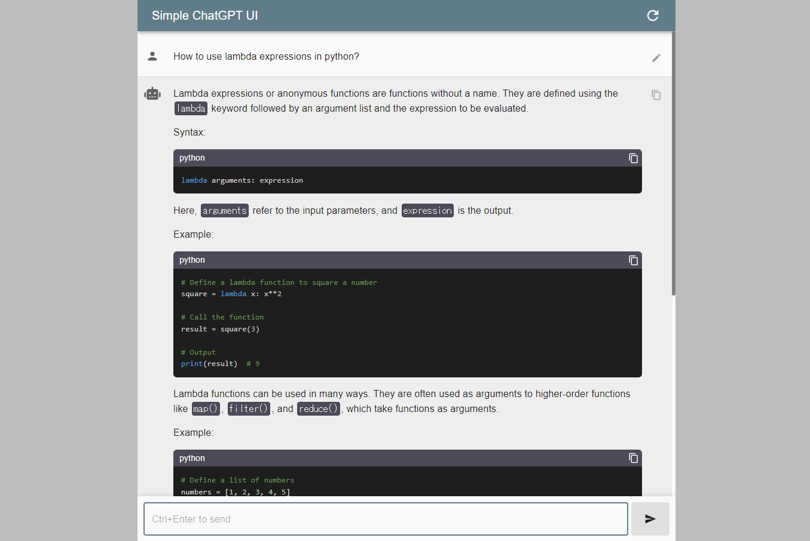

# Simple ChatGPT UI

Simple ChatGPT UI is a simple frontend application for conducting dialogues using the OpenAI API. It securely stores API keys and conversations in the client's local storage.

[Demo](https://matsuatsu.github.io/simple-chatgpt-ui/)

    

## Installation

To install this application, follow these steps:

1. Clone the GitHub repository.
2. Run the command `pnpm install`.

## Usage

To launch this application, follow these steps:

1. Run the command `pnpm run dev`.
2. Access `localhost:5173` in your browser.

## Disclaimer

When using this application, please note the following:

- This application uses the OpenAI API and requires an API key to function.
- This application directly returns the answers generated by ChatGPT, and the accuracy of the answers is not guaranteed.
- This application is a machine learning model, and unexpected results may occur in the responses.

## License

This application is released under the Unlicense license. Refer to the LICENSE file for more information.
